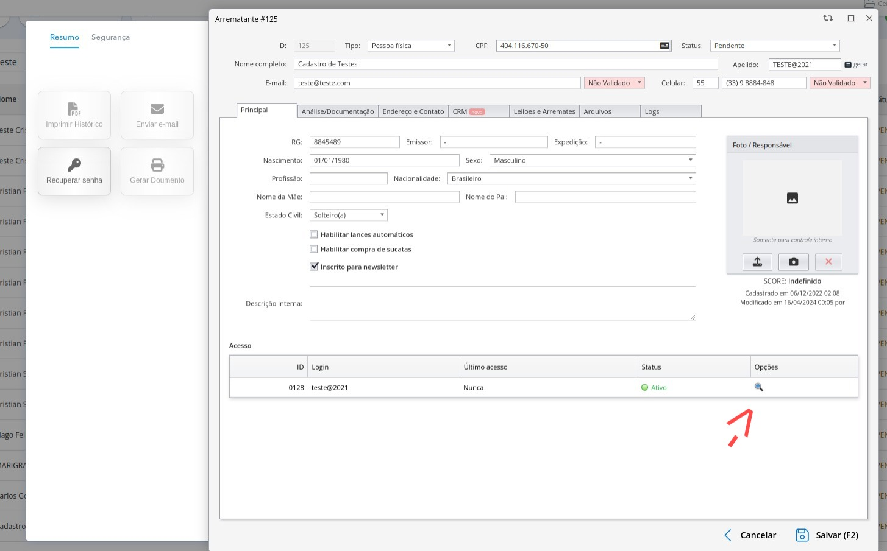
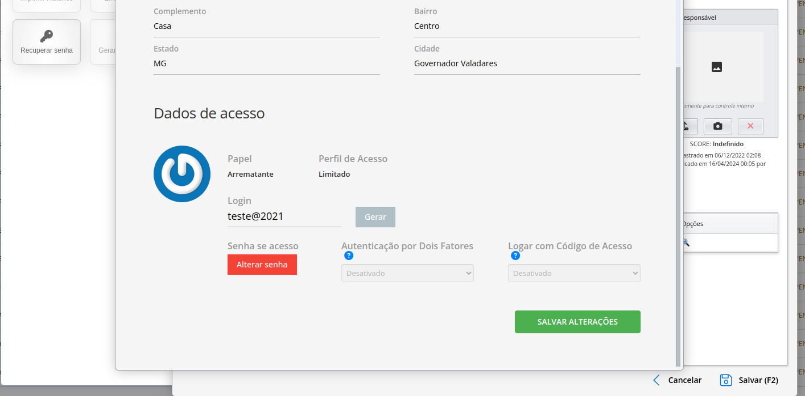

# Geração ou alteração de senha

Caso o arrematante não consiga redefinir a própria senha, ou mesmo tenha sido cadastrado através do ERP, a geração de nova senha pode ser feita através da página do seu cadastro.

Na página de arrematantes, faça a busca através dos campos disponíveis até encontrar os dados do arrematante desejado. Vá até o fim dos dados de cadastro do arrematante, até encontrar esse ícone:

Novamente, vá até o fim do formulário, até encontrar a opção de **Gerar uma nova senha** ou **Alterar senha**:

A nova senha poderá ser visualizada brevemente e/ou encaminhada para o arrematante pelos canais disponíveis. Após finalização do processo, basta salvar as alterações feitas.
