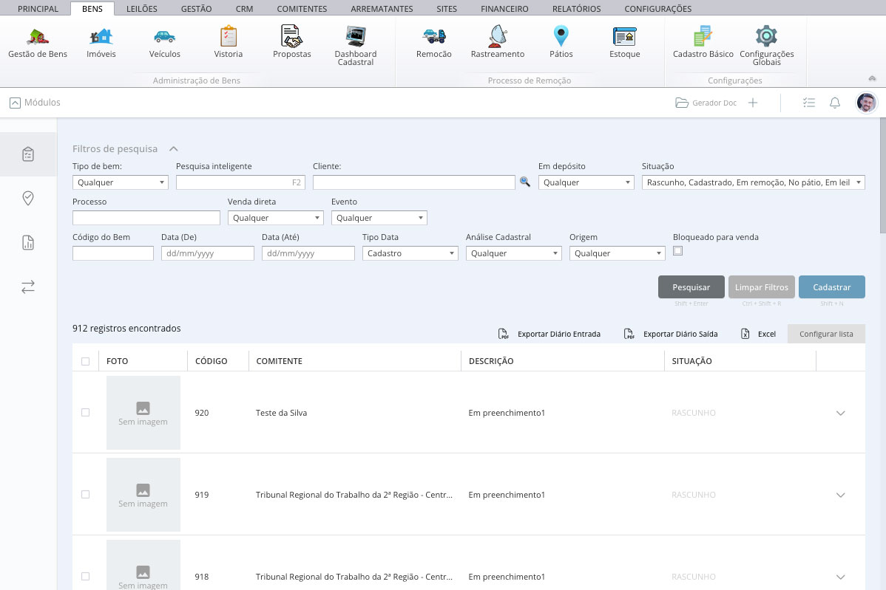
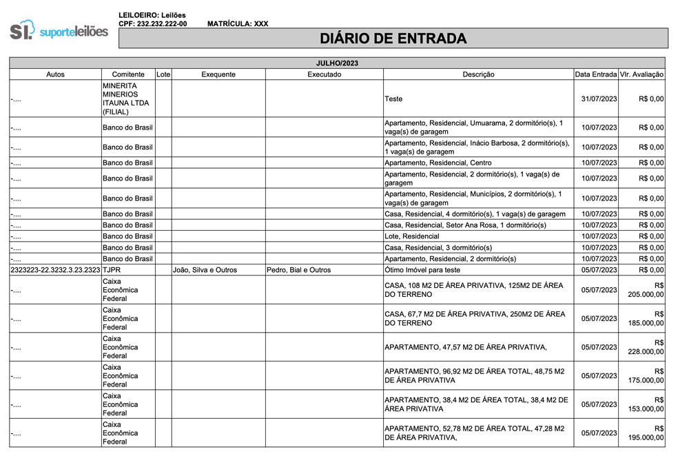
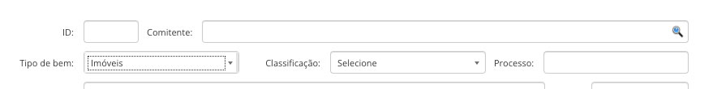
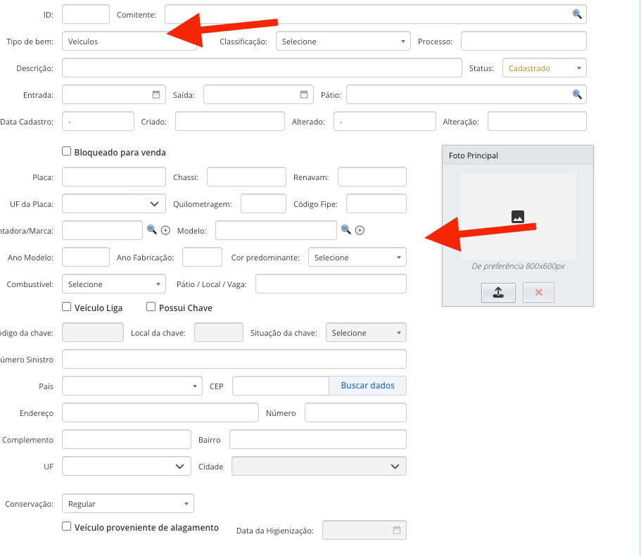
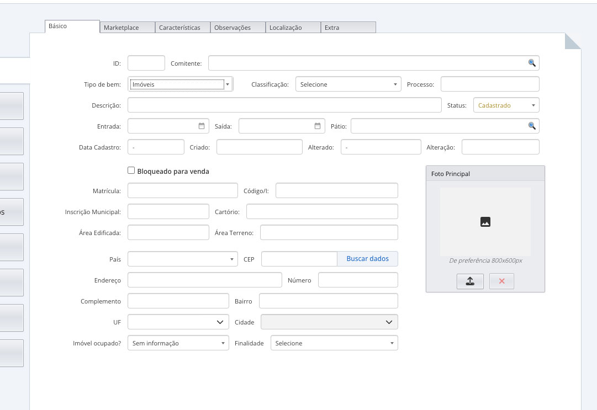
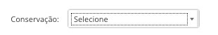
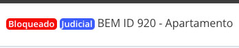
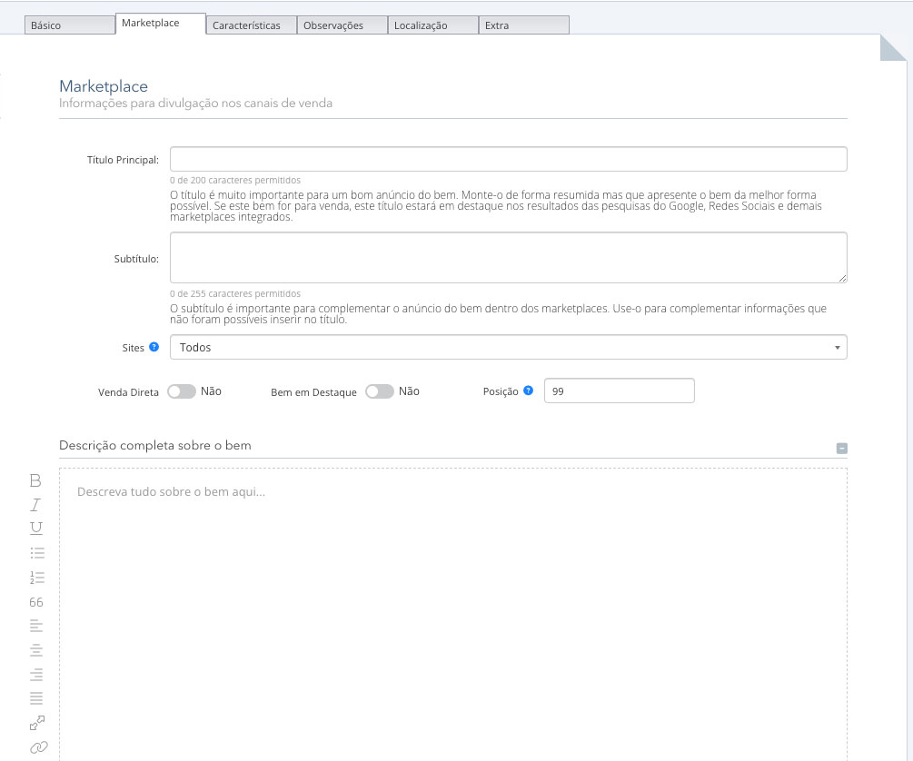

# Cadastro

## Pesquisa de Bens
Acesse  `Menu` -> `Bens` -> `Gestão de Bens` para abrir a tela de listagem de bens.

Note que no mesmo menu também temos `Imóveis` e `Veículos`, ambos os menus vão para a mesma tela de listagem, porém, o sistema adapta os filtros de pesquisa exclusivos para o tipo de bem selecionado.

*Tela de listagem de bens* 

Observe que a pesquisa é pré-fixada para pesquisar somente bens considerados **Em Estoque**, ou seja, bens com os seguintes status:

* Rascunho
* Cadastrado
* Em remoção (bens móveis)
* No pátio (bens móveis)
* Em leilão

Caso queira filtrar por bens fora do estoque, ou seja, bens Leiloados/Vendidos, Devolvidos ou Doados, basta selecioná-los no filtro **Status**:

Os demais filtros são sugestivos e de fácil entendimento.

### Exportar Diário de Entrada e Saída

**Diário de Entrada e Diário de Saída** são relatórios costomizáveis existentes no [Sistema de Documentos](../gestao/documentos.md) que são emitidos em PDF. Veja um exemplo:

 
 

Veja um exemplo de um diário de entrada emitido, em PDF:

*Exemplo de emissão de Diário de Entrada*

Os diários respeitam os critérios de pesquisa na lista de bens, ou seja, todos os filtros aplicados também serão aplicados ao gerar o diário.

### Exportar para Excel

Assim como os diários demonstrados acima, o relatório em excel respeita os filtros aplicados na listagem de bens. Ao clicar em *Excel*, o resultado filtrado é exportado para uma planilha em excel.

## Cadastrar um novo bem

Clique no botão **Cadastrar** para iniciar o registro de um novo bem no sistema.

Você precisa primeiro selecionar o comitente e qual o **Tipo** e **Classificação** do bem:

A escolha do tipo e classificação do bem, além de obrigatório, é crucial para que o sistema entenda quais campos apresentar para preenchimento, sendo que **Imóveis** e **Veículos** o sistema já possui campos próprios internos. Veja:

**Veículos:**

**Imóveis:**

Entendemos que mesmo que tenhamos os principais campos para o cadastro de um bem, pode existir situações onde o leiloeiro precise customizar estes campos baseando-se no tipo e classificação do bem, isto é possível, **[criando campos dinâmicos](../configuracoes/Global/Bem#campos)**.

:::tip

[Saiba como criar novos campos no bem](../configuracoes/Global/Bem#campos) e personalizar o cadastro de acordo sua necessidade, sem programação.

:::

### Imóveis

O cadastro de imóveis possui alguns campos exclusivos no sistema, são eles:

:::note[Campos exclusivos para o cadastro de `Imóvel`]

**Matrícula:** Matrícula do imóvel 
**Código/I:** Código Interno, pode ser usado para controle interno ou intregrações 
**Inscrição Municipal:** Inscrição Municipal do Imóvel 
**Cartório:** Nome do Cartório 
**Área Edificada:** Área construída no terreno 
**Área Terreno:** Área total do terreno 
**Imóvel Ocupado?:** Se o imóvel está ocupado ou não 
**Finalidade?:** Finalidade do cadastro do imóvel no sistema. **[Pré-cadastrado em Tipos de Finalidade de Imóvel](../configuracoes/CadastroBasico#tipos-de-finalidade-de-imóvel)** 
:::

### Veículos

O cadastro de veículos também possui alguns campos exclusivos no sistema, são eles:

:::note[Campos exclusivos para o cadastro de `Veículo`]

**Placa:** Placa do veículo. 
**Chassi:** Número do Chassi do veículo 
**Renavam:** Número do Renavam 
**UF da Placa:** UF da Placa do veículo. *Cuidado para não confundir com o outro campo UF mais abaixo, que se trata de onde o veículo está* 
**Quilometragem:** Km do veículo 
**Código Fipe:** Código Fipe do veículo. Isto pode ser preenchido automaticamente se tiver integração com a [Tabela Fipe](#) <!-- @TODO --> 
**Montadora/Marca:** Marca do Veículo. Pode ser [pré-cadastrado](../configuracoes/CadastroBasico#marcas-de-bem) ou importado a [Tabela Fipe](#) <!-- @TODO --> 
**Modelo:** Modelo do Veículo. Pode ser [pré-cadastrado](../configuracoes/CadastroBasico#modelos-de-bem) ou importado a [Tabela Fipe](#) <!-- @TODO --> 
**Ano Modelo:** Ano do modelo do veículo. *(Se a Tabela Fipe estiver integrada, o preenchimento é automático)* 
**Ano Fabricação:** Ano de fabricação do veículo. *(Se a Tabela Fipe estiver integrada, o preenchimento é automático)* 
**Cor predominante:** Cor do veículo [pré-cadastrada](../configuracoes/CadastroBasico#tipos-de-cor) 
:::

Os demais campos são padronizados em todos os tipos de bem.

:::tip
 

Saiba que a maioria dos campos de seleção você pode editar, basta acessar o [cadastro básico em configurações](../configuracoes/CadastroBasico) 

:::

### Básico

A aba Cadastro / Básico contém as informações básicas de um bem. Segue a explicação de função de cada campo:

:::note[`Cadastro` / `Básico`]

**ID:** Campo de identificação única gerado automaticamente pelo sistema. 
**Comitente:** Cliente que está consignando o bem. 
**Tipo de bem:** Tipo principal do bem. [Pode ser editado, exceto Imóveis e Veículos](../configuracoes/CadastroBasico#tipos-de-bem). 
**Classificação:** Tipo filho de um bem, é o tipo final selecionado. [Pode ser editado](../configuracoes/CadastroBasico#tipos-de-bem). 
**Processo:** Número do processo. Este campo não pode ser editado nesta tela, sobre na aba Processo. 
**Descrição:** Descrição interna do bem. Esta descrição também é copiada para o Título na aba Marketplace, caso não seja preenhido por lá. Caso preencha título do bem na aba Marketplace, e preencha a descrição com uma informação diferente, esta descrição aparecerá somente na listagem interna (ERP). 

**Status:** Situação do Bem. Entenda cada uma delas: 
- **Rascunho:** Bem em fase de cadastro e preparação
- **Cadastrado:** Bem no estoque, utilizado para bens imóveis ou bens que não estão em posse no pátio.
- **Em remoção:** Bem móvel que está em processo de remoção até o pátio.
- **No pátio:** Bem móvel que está armazenado no pátio.
- **Em leilão:** Bem que está em leilão.
- **Devolvido:** Bem devolvido para o comitente.
- **Doado:** Bem doado.
- **Leiloado/Vendido:** Bem Vendido.

**Entrada:** Data entrada do bem no estoque. Lembre-se que existe a data de cadastro, que é preenchida automaticamente pelo sistema. A data de entrada pode ser digitada manualmente e corresponde ao dia que o bem deu entrada no estoque. 
**Saída:** Data saída do bem do estoque. 
**Pátio:** Seleção do [pátio pré-cadastrado](./Patios), que o bem está armazenado. 
**Data Cadastro:** Data que o bem foi cadastrado no sistema. O preenchimento é automático e este campo não é editável. 
**Criado:** Pessoa que criou o bem no sistema. 
**Alterado:** Pessoa que alterou o bem no sistema. 
**Alteração:** Data da última alteração do bem no sistema. 

**Bloqueado para venda** Bloqueia o bem para venda, isto impede que o bem seja relacionado em leilões. Ao bloquear, um aviso também é emitido na tela do bem:

**Motivo do bloqueio** Motivo do bloqueio do bem, para histórico.
**Conservação** Conservação do bem [pré-cadastrado](../configuracoes/CadastroBasico#tipos-de-conservação-de-bem).
:::

### Marketplace

A aba Marketplace é responsável pelas informações principais do anúncio público do bem. O preenchimento estratégico ajuda em uma boa venda.

:::note[`Cadastro` / `Marketplace`]

**Título Principal:** . 
**Subtítulo:** . 
**Sites:** . 
**Venda Direta:** . 
**Bem em Destaque:** . 
**Posição:** . 
**Descrição completa sobre o bem:** . 
**Observações adicionais sobre o bem:** .  
:::

### Características
### Observações
### Localização
### Extra
### Gestão de Débitos
#### Gestão
#### Débitos
#### Financeiro
### Processo
#### Principal
#### Movimentações
### Avaliação
#### Básico
#### Vistoria
### Imagens, Vídeos e Arquivos
#### Fotos e Arquivos
#### Vídeos
### Remoção
### Leilões e Propostas
#### Principal
#### CRM
### Checklist / Providências
#### Principal
#### Providências
### Marketplace / API

