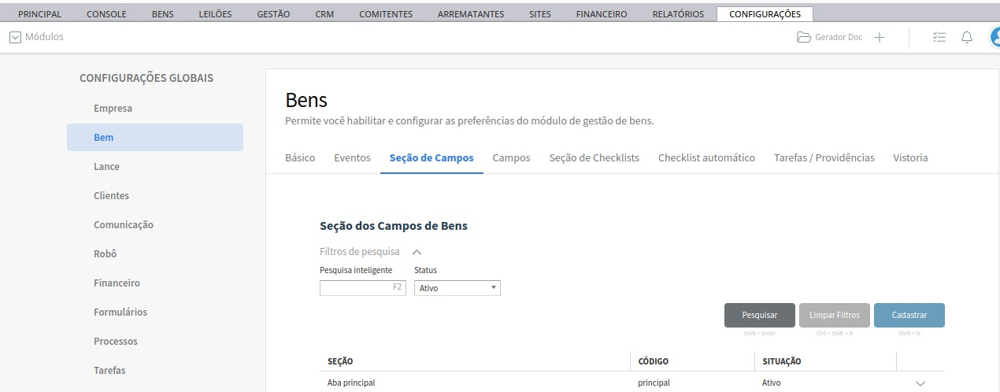
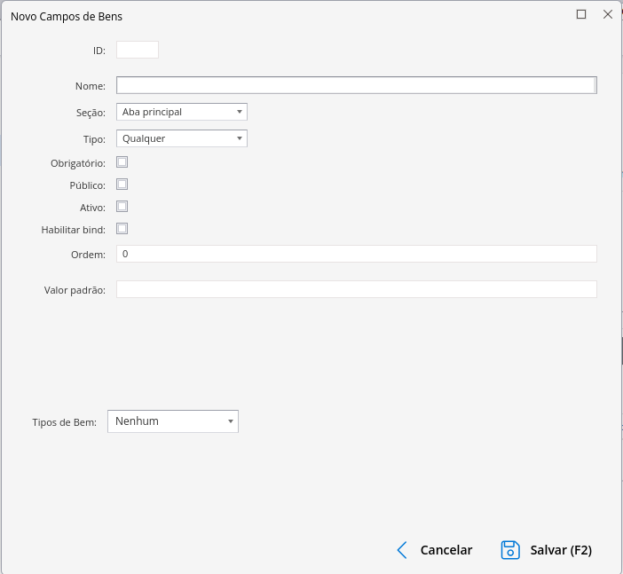
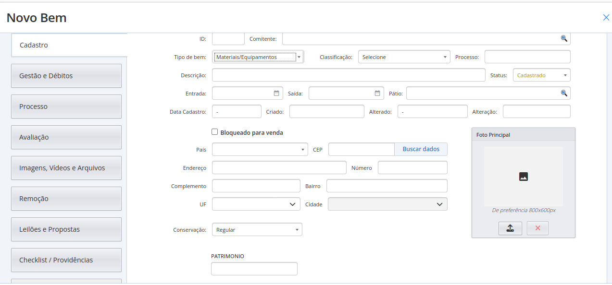

# Campos personalizados

Você sabia que dá pra criar e editar novos campos para serem utilizados no cadastro de bens? Siga os passos abaixo para entender melhor:

## Seção de campos

As seções de campos são os itens que irão definir aonde os campos serão criados e exibidos no cadastro, algumas das seções disponíveis são:

* Principal (Código Único: principal)
* Marketplace (Código Único: marketplace)
* Características (Código Único: característica)
* Observações (Código Único: observações)
* Extra (Código Único: extra)

Acesse `Menu` -> `Configurações` -> `Configurações Globais` -> `Bem` para acessar a tela de configurações e definições de bens. Após isso, acesse o submenu `Seção de Campos` para encontrar a listagem de seções.

Observe se há seções criadas, caso não haja, basta criar utilizando a opção de `Cadastrar` disponível.

:::note[Campos para o cadastro de `Seção`]

**ID:** Gerado automaticamente pelo sistema 
**Nome:** Nome usado para identificação interna 
**Código Único:** Código que irá identificar a seção no sistema, siga a tabela das seções informada anteriormente para visualizar o código individual de cada uma delas 
**Descrição:** Descrição interna  
**Ordem:** Gerado automaticamente 
:::

## Criação de Campos

Agora que você já entende melhor sobre as seções e como elas funcionam, está na hora de criar os campos.
Acesse `Menu` -> `Configurações` -> `Configurações Globais` -> `Bem` -> `Campos` para encontrar os campos personalizados.

Para cadastrar um campo, deverá ser preenchido o seguinte formulário:

:::note[Campos para o cadastro de `Bem`]

**ID:** Gerado automaticamente pelo sistema 
**Nome:** Nome usado para identificação interna 
**Seção:** Seção em que o campo será exibido, deve ter sido previamente cadastrada, como mostrado no tópico anterior 
**Tipo:** O tipo do campo, se será um campo simples de texto, uma caixa de seleção ou um campo para armazenar um texto maior, de acordo com as opções disponíveis  
**Obrigatório:** Define se o preenchimento do campo será obrigatório para salvar o bem 
**Público:** Define se o campo será ou não público 
**Ativo:** Define se o campo está ativo e em uso(campos desativados não são exibidos) 
**Ordem:** Gerado automaticamente 
**Valor padrão:** Define umm valor padrão para pré-preenchimento 
**Tipos de Bem:** Selecione para quais bens o campo estará disponível (Exemplo: imóveis, veículos, etc) 
:::

Após o cadastro, siga para `Menu` -> `Bens` -> `Gestão de Bens` -> `Cadastrar` para criar um novo bem, e visualizar o seu novo campo :

Além disso, seus campos também estarão disponíveis para preenchimento em bens já criados.

:::tip
Certifique-se de escolher a seção e o tipo de bem correto para visualização dos seus campos.
:::
