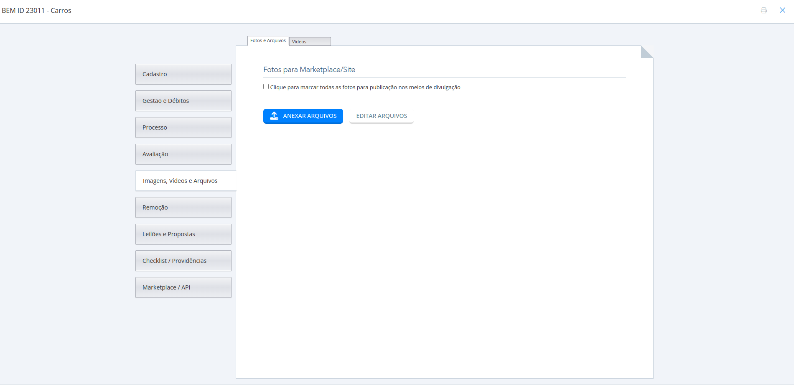
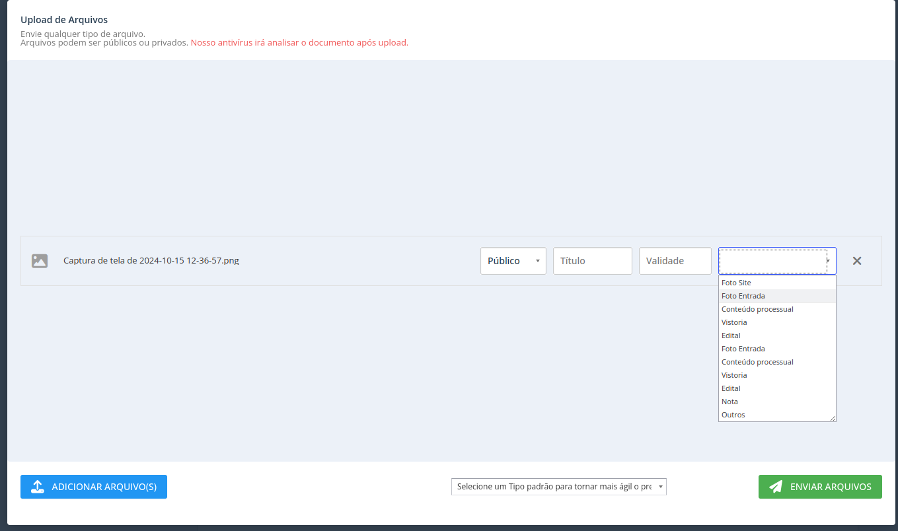
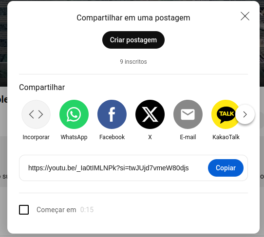
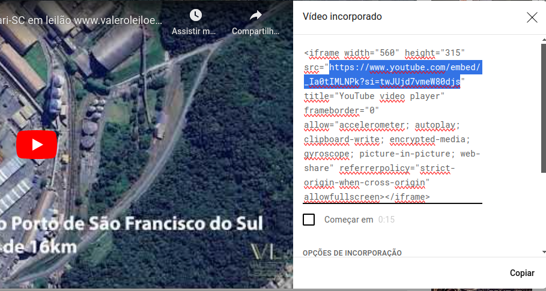
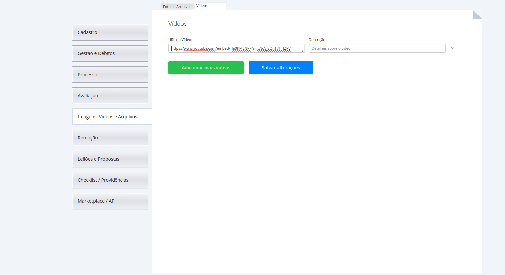

# Imagens, vídeos e arquivos

As imagens, vídeos e arquivos de um bem são algumas das partes mais importante para garantir uma boa visibilidade e atenção para o leilão, portanto não devem ser deixadas de lado.
Para incluir as imagens, vídeos ou arquivos do bem, acesse o cadastro de um bem (se não souber como, acesse **[Pesquisa de bens](../bens/##Pesquisa_de_Bens)**)

Já com a tela de cadastro, vá para o menu `Imagens, Vídeos e Arquivos`.

Ao anexar um arquivo, deverão ser preenchidos os campos relacionados à privacidade do arquivo, título, validade e **Tipo de arquivo**, como mostrado abaixo:

**Lembrete:** Imagens do bem que irão aparecer no site devem estar com o tipo de arquivo **Foto Site**.

## Vídeos

Para incluir vídeos, ainda no mesmo bem, selecione a opção `Vídeos` e `Adicionar vídeo`
No campo de **URL do vídeo**, deverá ser incluído o link de incorporação do vídeo desejado, que pode ser adquirido utilizando as opções de `Compartilhar` e `Incorporar`:

Em seguida, copie o link contido dentro das aspas duplas após a nomenclaura src, como mostrado abaixo:

Feito isso, cole o link e utilize a opção `Salvar alterações`:

