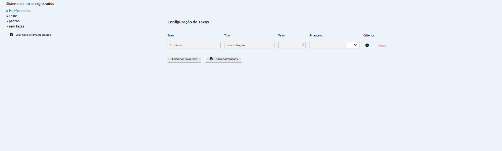

# Taxas

As taxas admnistrativas, de comissão ou qualquer outro tipo, são divididas em sistemas de taxação, aqui você aprenderá a criar e gerenciar sistemas de taxação.

Vá para `Menu` -> `Configurações` -> `Taxas` para acessar os sistemas de taxas existentes.
É possível adicionar, alterar ou remover valores de taxas, respeitando as seguintes definições:

:::note[Campos]

**Taxa:** Nome da taxa, que será exibido nos valores e documentos. 
**Tipo:** Define o tipo de taxa, se será um valor fixo ou porcentagem 
**Valor:** Valor exato da taxa, em porcentagem ou fixo. 
**Critérios:** Critérios para aplicação da taxa, como tipo de bem, valor ou comitente, usado para taxas e situações específicas  
:::

<strong>Atenção:</strong> Ao colocar valores não inteiros (exemplo: 975,55), deve-se utilizar .(ponto) Ao invés de ,(vírgula) portanto, o correto será 975.55.

 

<strong>Atenção:</strong> Ao cadastrar nova comissão, deve-se colocar a primeira letra(C) em maiúsculo, para que o sistema identifique corretamente.

