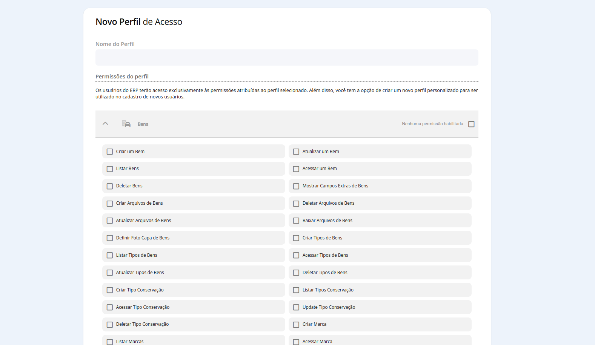

## Como criar um perfil de acesso

Para acessar, vá em `Menu` -> `Configurações`-> `Usuários` -> `Grupos de Acesso`

Antes criar um novo grupo de acesso, é importante entender que os grupos de acesso servem para regulamentar as funções e permissões de um deteerminado grupo de usuários no sistema.

Para criar um novo grupo de acesso, utilize **Criar Novo Perfil**.

As permissões são selecionadas por módulos, podendo dar acesso à umm módulo completo (com todas as permissões) ou parcial, selecionando manualmente cada item que será atribuído para este grupo de acesso.

Após definir as permissões, salve e nomeie o seu novo grupo de acesso. Agora é só cadastrar seus novos usuários e atribuir à eles o grupo de permissões criado por você.