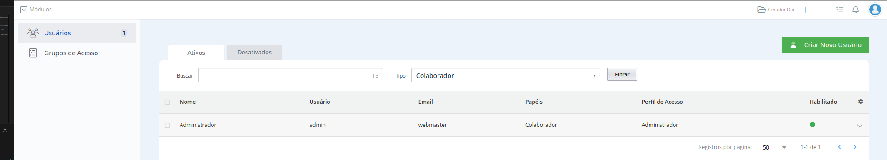
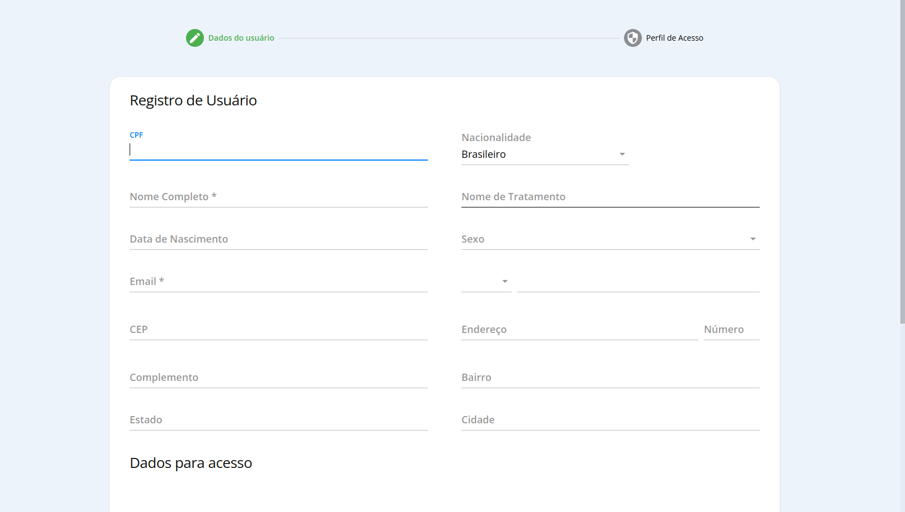
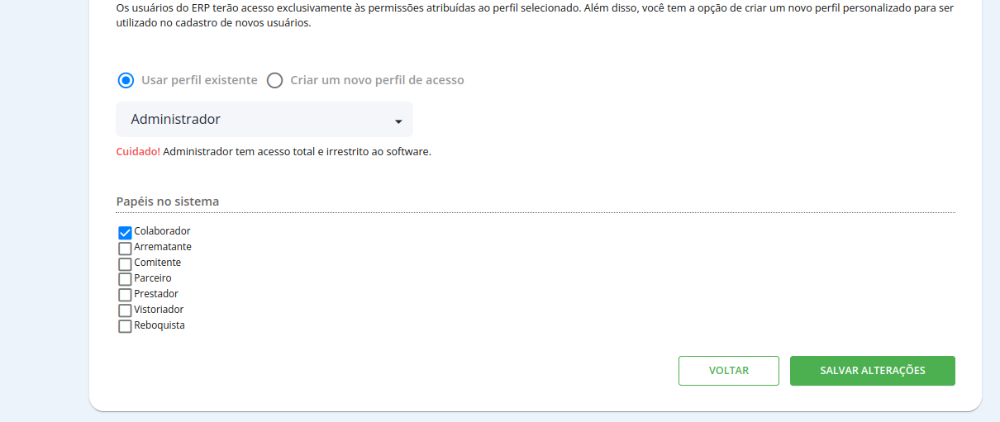

# Usuários

## Gestão de usuários

Nosso módulo de usuários oferece todos os recursos para gerenciar os usuários e seus perfis de acesso ao sistema. Acesse `Menu` -> `Configurações` -> `Usuários` para acessar a lista de usuários.

## Cadastro de usuários

Já no menu de usuários, use o campo **Criar Novo Usuário** no canto superior direito para visualizar os campos para cadastro, como mostrado no exemplo abaixo:

Após o preenchimento dos campos e dados pessoais do usuário (Campos marcados com * indicam itens obrigatórios), basta salvar e escolher o perfil de acesso do usuário.

## Perfil de acesso de usuário

Os perfis de acesso servem para limitar e delegar a função de cada usuários dentro do sistema, gerenciando menus e permissões que ele terá enquanto acessa o sistema com seu login.

Veja também:

#### Como criar um perfil de acesso
