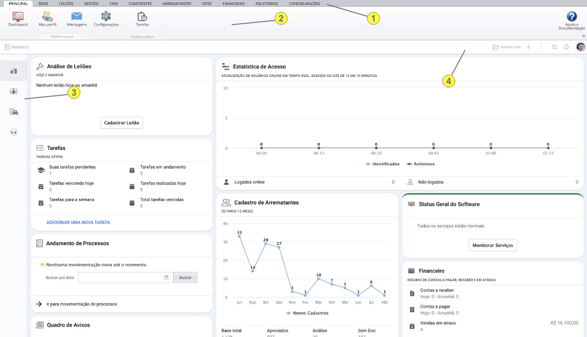
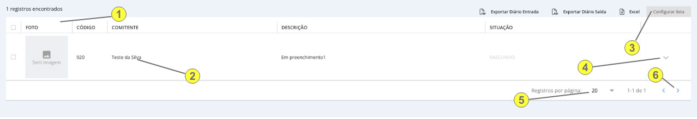

# Experiência do Usuário

Buscamos aprimorar cada vez mais para levar a melhor experiência dos usuários no uso do nosso software. Nosso objetivo é uma interface objetiva e que forneça o máximo de ações e informações em pouco espaço em tela.

Abaixo explicamos um pouco sobre a nossa interface e componentes mais comuns:

1) Menu de Módulos;
2) Menu de Componentes de um Módulo;
3) Menu Lateral de um componente com atalhos rápidos;
4) Menu do usuário e atalhos rápidos.

Em todo o sistema você vai se deparar com lista de dados, segue uma explição sobre como usá-las:

1) Coluna da lista, se ao passar o mouse ela for clicável, você poderá ordenar de forma crescente ou decrescente;
2) Você pode clicar duas vezes rapidamente com o mouse para abrir um item de uma lista;
3) Você pode configurar os itens das colunas da lista, adicionando ou removendo itens conforme sua necessidade. Fique atento pois em algumas listas, ao invés do botão "Configurar Lista", pode existir um ícone de configuração;
4) Menu de opções do item da lista;
5) Número de itens por página;
6) Avançar ou voltar páginas.

No mais, nossa interface é bem intuitiva e de fácil aprendizado.
